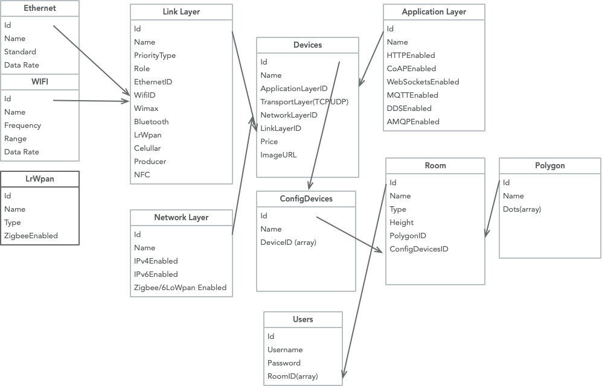

# Project Title

API made for the IoT Simulator APP in order to get and receive different types of requests 



## Getting Started
Make sure you have installed:

* [Node](https://nodejs.org/en/) NodeJS
* [MongoDB](https://www.mongodb.com/download-center#community) Atlas or Community Server

### Prerequisites
* Run ```npm install``` 
* If you run locally run the mongodb first using the command ```mongod``` and 
make sure to use the right connection string ```mongoose.connect("mongodb://localhost/iot-simulator")```
* Run ```nodemon index.js``` nodemon will watch for changes on your code

### Installing

Using git

```
 git clone https://gitlab.com/cristian.cernat97/iot-simulator-api
```
or download the zip file

## Testing and Middleware
...soon...

## Built With

* [Nodemon](https://github.com/remy/nodemon) Watcher
* [Mocha](https://mochajs.org/) Test Framework
* [Mongoose](https://mongoosejs.com) ODM
* [MongoDB](https://www.mongodb.com/download-center#community) NoSQL database
* [Node](https://nodejs.org/en/) NodeJS

## Contributing

Go ahead blame me for anything I am still learning 
## Versioning

Version 1.017

## Authors

* **Cristian Cernat** - (https://gitlab.com/cristian.cernat97)
